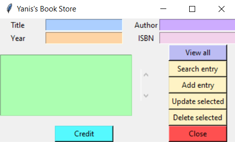
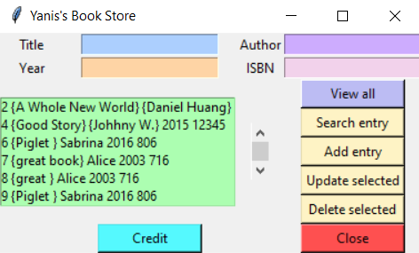
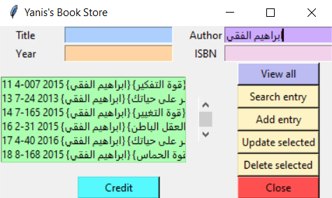
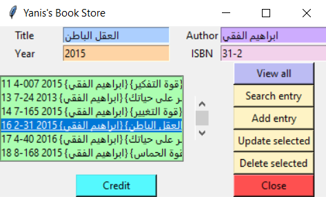

# Bookstore
[](LICENSE)


This is a simple bookstore app written in Python With Tkinter module, and the database created with Sqlite3 module.<br>
This program contains both front-end and back-end code for a bookstore app with a simple **GUI** (graphical user interface).<br>
Click <a href="https://docs.python.org/3/library/tk.html" > here </a> to read more about **tkinter** module.<br>
Click <a href="https://docs.python.org/3/library/sqlite3.html"> here </a> to read more about **sqlite** module.

## #100daysofcode
Almost a hundred days ago from now (01/10/2020), I decided to do the #100daysofcode challenge. This challenge is simply for someone to code every day and post on social media a picture shows that he wrote a code (every day). And than they share with us the final project.<br>
But me..! I did it differently, every day I built apps, games, web pages or desktop apps. Every day something new and I shared all my apps simulation on my Instagram account (you can see my highlight stories), click <a href='https://instagram.com/medyanis_hiou' target='_blank'>here</a> if you wanna see it. And than I'll mix all my small apps in one big project. So I decided to share all the projects with you.<br><br>
PS: You can check all my project <a href='http://y100daysofcode.ml' target='_blank'>here</a><br>

## Features :dart:
* [x] Free & Open Source
* [x] Very Easy to use
* [x] No Internet connection required
* [x] Supportive of the Arabic language
* [x] <del>Buy by email

## Options:
* [x] Show all existing books by clicking on the "**View all**" button.
* [x] Search specific bookm just enter qny information(Title, Year, Author or ISBN) and click on the "**Search entry**" button.
* [x] Ability to add many books to the store, just enter all the information of the book and click on "**Add entry**" button.
* [x] Ability to modify the book information by double click on the book, modify, and finally click on the "**Update selected**" button.
* [x] You can also delete any book from the store, just selecte the book you wanna delete it and click on "**Delete Selected**" button.

# Thank _You_!
Please :star: this repo to help us improve the quality.

## Screenshots
Home           | View All
:---------------------:|:------------------:
 |  <br>
Search Entry           | The Selected Book Information
 | 

## Requirements
* python
* tkinter module
* sqlite module

## How To Use It
1. Download Python from this link: https://www.python.org/downloads/
2. Install the packeges, write in your command (cmd):
```bash
pip install tkinter
pip install pysqlite3
```
3. Install this repository, click <a href="https://github.com/mohamedyanis/bookstore/archive/master.zip"> here </a> to install it.
4. Extract the folder
5. Run the ```frontend.py``` file

## Contributing 💡
If you want to contribute to this project and make it better with new ideas, your pull request is very welcomed.<br>
If you find any issue just put it in the repository issue section, thank you.<br><br>
.سبحَانَكَ اللَّهُمَّ وَبِحَمْدِكَ، أَشْهَدُ أَنْ لا إِلهَ إِلأَ انْتَ أَسْتَغْفِرُكَ وَأَتْوبُ إِلَيْكَ
